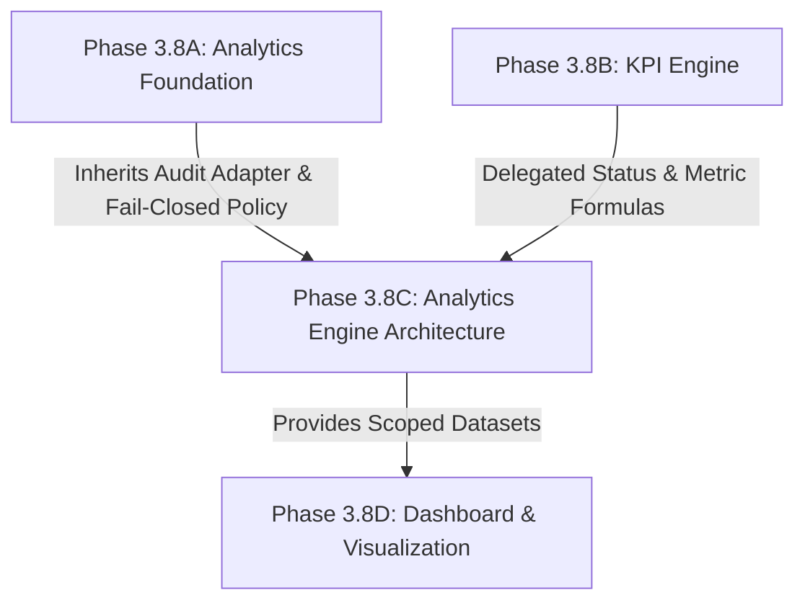
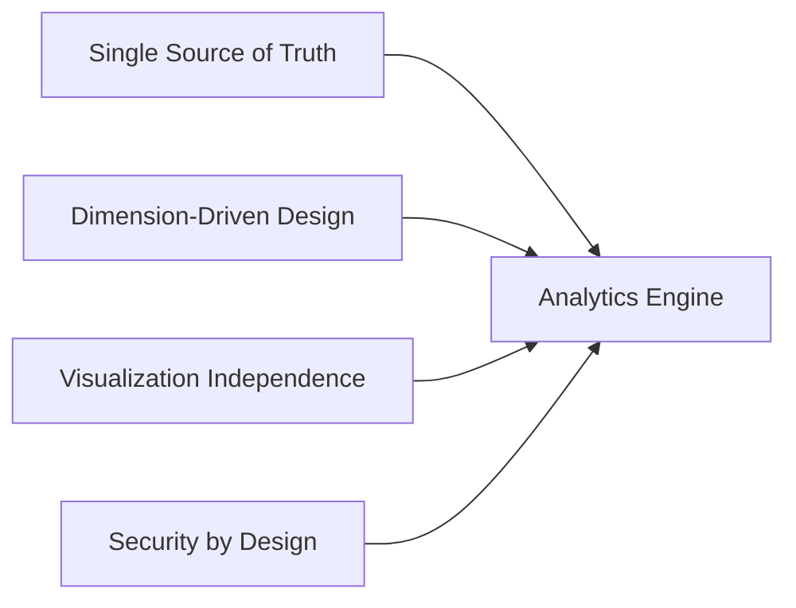
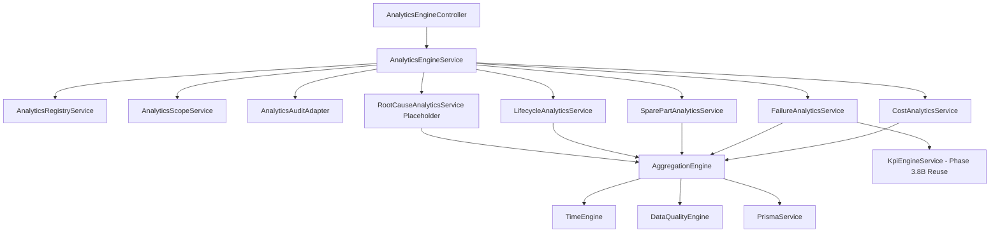
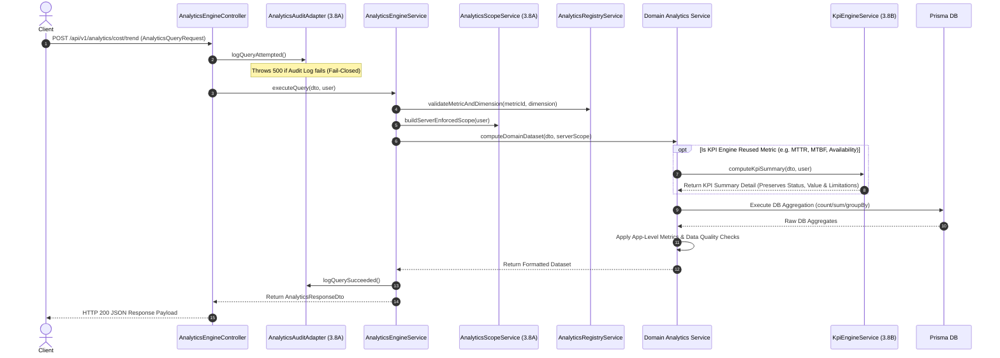
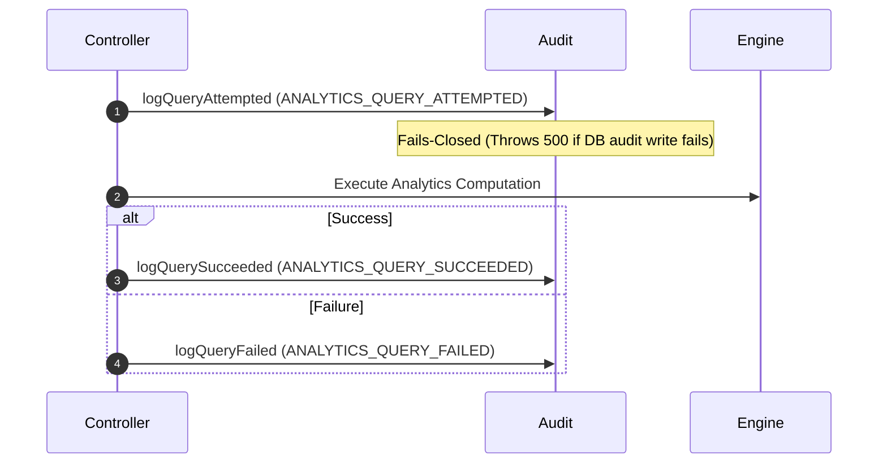

# Phase 3.8C – Analytics Engine Architecture Proposal (Revision 2.1 Final)

**Document Status:** `GATE 1 ARCHITECTURE APPROVED CONDITIONALLY`  
**Gate:** `Gate 1 — Analysis and Architectural Design (Revision 2.1 Final)`  
**Baseline Inherited:** `Phase 3.8A (Analytics Foundation)` & `Phase 3.8B (KPI Engine)`  
**Scope Constraint:** Architecture & Design Specification Only (No code, no migrations, no frontend changes, no schema modifications, no Gate 2 transition).

---

## 1. Executive Summary

Phase 3.8C Revision 2.1 Final establishes the **Analytics Engine Architecture** for the CMMS platform. Retaining the core architectural principles—**Dimension-Driven Architecture**, **Single Source of Truth**, **Visualization Independence**, and **Security-by-Design**—this proposal resolves all remaining metric definitions, role-scope mappings, data quality contracts, future schema specifications, and repository verification policies.

The Analytics Engine processes operational datasets across five core functional domains:
1. **Cost Analytics** (Maintenance expenditure, spare part proxy costs, cost per WO/equipment/department)
2. **Failure Analytics** (Failure incident classification, Recorded WO Creation Trends, Failure Cause Text Breakdown, Top Failing Equipment, with MTTR/MTBF/Availability status delegated to KPI Engine Phase 3.8B)
3. **Spare Part Analytics** (Global Low-Stock Item Snapshots, Issued Quantities, Issue Transaction Counts, Current Stock Levels)
4. **Lifecycle Analytics** (Equipment Age Distribution from record date, Maintenance Frequency per age proxy)
5. **Root Cause Analytics** (Text-based failure cause distribution under Failure domain; Root Cause & CAPA metrics set to `N/A` pending schema extension)

By enforcing **Population Matching**, **Server-Enforced Scope**, and **Fail-Closed Audit Semantics**, Revision 2.1 Final delivers strongly typed JSON datasets (`Trend`, `Ranking`, `Matrix`) for consumption by Phase 3.8D (Dashboard & Visualization).

---

## 2. Scope

- **Architectural Specification & Data Modeling:** Complete design of the generic `Aggregation Engine`, `Metric Registry`, and `Dimension Registry`.
- **Domain Analytics Definitions:** Formal business logic, formulas, data sources, and status policies (`OK`, `ESTIMATED`, `PARTIALLY_SUPPORTED`, `DELEGATED_TO_KPI_ENGINE`, `PENDING_BUSINESS_RULE`, `N/A`) for Cost, Failure, Spare Part, Lifecycle, and Root Cause Analytics.
- **Security & Authorization Framework:** Strict server-enforced role-based & attribute-based scope composition for `ADMIN`, `MANAGER`, `TECHNICIAN`, and `OPERATOR`.
- **API & Response Contracts:** Formal DTO contracts for `TrendDataset`, `RankingDataset`, and `MatrixDataset` including comprehensive `AnalyticsResponseMetadata`.
- **Data Quality & Anomaly Specification:** Standardized data quality rules classifying 15 warning and validation codes with a defined behavior mapping.
- **Audit & Compliance Integration:** Alignment with Phase 3.8A `AnalyticsAuditAdapter` enforcing ALCOA+ audit trails and Fail-Closed execution semantics.
- **Performance Budget & Caching Strategy:** Execution thresholds ($\le 2.0\text{s}$ p95, $\le 4$ DB round-trips) and `scopeFingerprint` cache key composition.

---

## 3. Out of Scope

- **No Code Implementation:** Zero TypeScript backend/frontend code written in Revision 2.1 Final.
- **No Database Migrations:** Zero DDL or Prisma schema modifications.
- **No UI / Charting / Visualization:** Chart rendering, colors, widgets, and layout components belong exclusively to Phase 3.8D.
- **No Export Generation:** File rendering (PDF, Excel, CSV) belongs to Phase 3.9 (Report Export Service).
- **No Predictive AI / ML Modeling:** Remaining Useful Life (RUL) is set to `N/A` or `RULE_BASED ESTIMATED`.

---

## 4. Baseline Dependencies

Phase 3.8C strictly inherits and locks all architectural baselines from previous phases:



1. **Identity & Scope:** `req.user` is the single trusted identity source. Client-supplied headers are strictly rejected for authorization.
2. **Server-Enforced Scope:** User-provided filters can ONLY narrow data within the user's server-enforced scope, never expand access.
3. **Fail-Closed Audit:** If audit logging fails, the analytics operation aborts immediately with HTTP 500 without returning data.
4. **No Name-Based Authorization:** `technicianName` and `department` strings without immutable foreign key relations are rejected for access control.
5. **Metric Transparency:** Metrics with insufficient or unreliable data relationships return `value = null`, `status = 'N/A'`.

---

## 5. Current Schema Capability Matrix (Revision 2.1)

An audit of `backend/prisma/schema.prisma` against Phase 3.8C analytics requirements:

| Analytics Capability | Model / Field Source | Schema Support Status | Technical Limitation | Impacted Analytics |
| :--- | :--- | :---: | :--- | :--- |
| **Equipment Department Ownership** | `Equipment` model | `NONE` | Lacks direct `departmentId` column; relations exist only via `requests` array. | Availability, Cost & Failure Frequency for Manager (`status = N/A`) |
| **Technician Assignment (Preventive)** | `WorkOrder.scheduleId` | `PARTIALLY_SUPPORTED` | Via `MaintenanceSchedule.assignedTechnicianId`. | Preventive WO Analytics for Technician |
| **Technician Assignment (Corrective)** | `WorkOrder.technicianName` | `NONE` | String name only; no immutable `assignedTechnicianId` FK on WorkOrder. | Corrective WO Analytics for Technician (`status = N/A`) |
| **InventoryTransaction Scope Path** | `InventoryTransaction` model | `NONE` | Transaction has no direct `departmentId` or `technicianId` FK. Links to WO via `workOrderId`. Non-WO transactions (receipts, adjustments) have no scope link. | Spare Part Analytics for Manager / Technician (`status = N/A` or `403`) |
| **Spare Part Cost (Current)** | `InventoryItem.unitPrice` | `PARTIALLY_SUPPORTED` | `unitPrice` exists on `InventoryItem`. | Spare Part Value (`status = ESTIMATED`, proxy) |
| **Spare Part Cost (History)** | N/A | `NONE` | No historical snapshot price at transaction time. | Historical Cost Accuracy (`status = N/A`) |
| **Labour Cost** | N/A | `NONE` | No hourly labour rate or technician time tracking in schema. | Labour Cost Analytics (`status = N/A`) |
| **Downtime Cost** | N/A | `NONE` | No downtime financial loss rate per equipment or line. | Downtime Cost Analytics (`status = N/A`) |
| **External Service Cost** | N/A | `NONE` | No vendor invoice or external service model. | External Service Cost (`status = N/A`) |
| **Failure Cause (Text)** | `WorkOrder.failureCause` | `PARTIALLY_SUPPORTED` | Free-text string field; lacks canonical category ID. | Failure Cause Text Breakdown (`PARTIALLY_SUPPORTED`) |
| **Root Cause / CAPA** | N/A | `NONE` | No Root Cause, 5-Why, or CAPA models in CMMS schema. | Root Cause & CAPA Analytics (`status = N/A`) |
| **Equipment Age** | `Equipment.createdAt` | `PARTIALLY_SUPPORTED` | Uses `createdAt` as commissioning date proxy; lacks `installationDate`. | Lifecycle Age Distribution (`status = ESTIMATED`) |
| **Stock Ledger / Balance History** | N/A | `NONE` | No periodic stock balance history model. | Inventory Turnover & Stockout Events (`status = N/A`) |

---

## 6. Repository Limitation Review

1. **`WorkOrder.requestId String? @unique` Constraint:**
   - **DB Reality:** Enforces a 1-to-1 database cardinality between `WorkOrder` and `MaintenanceRequest`.
   - **Analytics Engine Impact:** Each Corrective Work Order links to at most 1 Maintenance Request. Duplicate mapping attempts are trapped as `RELATION_INTEGRITY_ANOMALY` and excluded.
2. **Lack of `assignedTechnicianId` on Corrective Work Orders:**
   - Corrective Work Orders (`requestId != null && scheduleId == null`) rely on string `technicianName`.
   - **Analytics Engine Impact:** For the `TECHNICIAN` role, all aggregate metrics containing Corrective WOs return `value = null`, `status = 'N/A'` to prevent incomplete or unauthorized data leakage.
3. **Lack of `department` on `Equipment` and `MaintenanceSchedule`:**
   - Equipment lacks a direct `department` column.
   - **Analytics Engine Impact:** Manager scope (`request.department = user.department`) strictly filters Work Orders originating from Requests in the Manager's department. Equipment-level Availability and Ratios for `MANAGER` return `status = 'N/A'`.
4. **Lack of Department/Technician Scope Path on `InventoryTransaction`:**
   - `InventoryTransaction` lacks direct `departmentId` and `technicianId` foreign keys.
   - Non-WO transactions (receipts, adjustments, returns without WO) cannot be scoped to a Manager or Technician. Manager/Technician Spare Part Analytics for non-WO transactions return `status = 'N/A'` or **HTTP 403 Forbidden**.

---

## 7. Proposed Architecture

### 7.1. Core Architectural Pillars



1. **Single Source of Truth:** All core business KPIs (MTTR, MTBF, Availability, Response Time) delegate status and value calculation directly to `KpiEngineService` (Phase 3.8B). No analytics metric re-implements core KPI formulas.
2. **Dimension-Driven Architecture:** Domain analytics services do not create separate per-entity services (`EquipmentAnalyticsService`, `DepartmentAnalyticsService`). Instead, a unified `Aggregation Engine` evaluates:
   $$\text{Dataset} = \text{Metric} + \text{Dimension} + \text{Time Grain} + \text{Validated Filters} + \text{Server Scope}$$
3. **Visualization Independence:** The Analytics Engine outputs raw, strongly-typed JSON contracts (`Trend`, `Ranking`, `Matrix`). It contains zero UI formatting, color codes, or rendering logic.
4. **Security by Design:** Every query execution combines Server-Enforced Scope (`AND`) Validated User Filters (`AND`) Business Inclusion Rules.

---

## 8. Module Decomposition

```
src/modules/analytics/
├── controllers/
│   └── analytics-engine.controller.ts    # Domain API Endpoints (POST /cost/trend, /failure/ranking, etc.)
├── services/
│   ├── analytics-engine.service.ts        # Orchestrator & Dispatcher
│   ├── analytics-registry.service.ts      # Metric & Dimension Metadata Registry
│   ├── analytics-scope.service.ts         # Inherited Server Scope Builder
│   ├── cost-analytics.service.ts          # Domain Service: Cost
│   ├── failure-analytics.service.ts       # Domain Service: Failure
│   ├── spare-part-analytics.service.ts    # Domain Service: Spare Parts
│   ├── lifecycle-analytics.service.ts     # Domain Service: Lifecycle
│   └── root-cause-analytics.service.ts    # Domain Service Placeholder: Root Cause (Gate 2 N/A contract)
├── engine/
│   ├── time-engine.ts                     # Time Bucketing & Window Utilities
│   ├── aggregation-engine.ts              # DB & App-level Aggregators
│   └── data-quality-engine.ts             # Anomaly Classification & Metadata Builder
└── dto/
    ├── analytics-query.dto.ts             # Unified Request DTO
    └── analytics-dataset-response.dto.ts  # Trend, Ranking, Matrix & Metadata DTOs
```

*Note on `RootCauseAnalyticsService`:* In Gate 2, `RootCauseAnalyticsService` performs only metadata exposure, capability validation, N/A response contract formatting, and integration placeholder logic. It will NOT compute root causes from free-text `failureCause`.

---

## 9. Dependency Diagram



---

## 10. Data Flow



---

## 11. Metric Registry Design

Every metric supported by the Analytics Engine must be registered in the `MetricRegistry`:

```ts
export interface AnalyticsMetricDefinition {
  metricId: string;
  domain: 'COST' | 'FAILURE' | 'SPARE_PART' | 'LIFECYCLE' | 'ROOT_CAUSE' | 'KPI_REUSE';
  label: string;
  description: string;
  unit: string | null;
  analyticsType: 'DESCRIPTIVE' | 'ESTIMATED' | 'PREDICTIVE';
  aggregationType: 'COUNT' | 'DISTINCT_COUNT' | 'SUM' | 'AVERAGE' | 'MEDIAN' | 'MIN' | 'MAX' | 'RATIO' | 'PERCENTAGE';
  requiredFields: string[];
  supportedDimensions: string[];
  supportedTimeGrains: ('DAY' | 'WEEK' | 'MONTH' | 'QUARTER' | 'YEAR')[];
  dateFieldPolicy: string;
  scopePolicy: string;
  dataQualityPolicy: string;
  statusPolicy: 'OK' | 'ESTIMATED' | 'PARTIALLY_SUPPORTED' | 'DELEGATED_TO_KPI_ENGINE' | 'PENDING_BUSINESS_RULE' | 'N/A';
  sourceService?: 'KPI_ENGINE' | 'ANALYTICS_ENGINE';
  reusedKpiMetricId?: string;
}
```

---

## 12. Dimension Registry Design

Supported analysis dimensions registered in `DimensionRegistry`:

```ts
export interface AnalyticsDimensionDefinition {
  dimensionId: string;
  label: string;
  modelSource: string;
  relationPath: string;
  idKey: string;
  labelKey: string;
  supportStatus: 'SUPPORTED' | 'PARTIALLY_SUPPORTED' | 'NOT_SUPPORTED';
  scopeCompatibility: string[];
  schemaGapNote?: string;
}
```

---

## 13. Metric Catalogue (Revision 2.1 Policies)

### 13.1. Cost Analytics Domain
| Metric ID | Domain | Label | Unit | Status Policy | Data Source / Proxy Explanation |
| :--- | :--- | :--- | :---: | :---: | :--- |
| `COST_TOTAL` | COST | Total WorkOrder Cost | `VND` | `ESTIMATED` | `WorkOrder.totalCost` (Pending User decision on cost components) |
| `COST_SPARE_PART_CURRENT_PRICE_PROXY` | COST | Spare Part Value (Current Price) | `VND` | `ESTIMATED` | `InventoryTransaction.quantity * InventoryItem.unitPrice` |
| `COST_LABOUR` | COST | Labour Cost | `VND` | `N/A` | Schema Gap: No hourly labour rate model |
| `COST_DOWNTIME` | COST | Downtime Financial Loss | `VND` | `N/A` | Schema Gap: No downtime financial loss rate |
| `COST_EXTERNAL_SERVICE` | COST | External Service Cost | `VND` | `N/A` | Schema Gap: No external service invoice model |
| `COST_PER_WO` | COST | Average Cost per Work Order | `VND` | `ESTIMATED` | `WorkOrder.totalCost / Completed WOs` |
| `COST_BREAKDOWN` | COST | Cost Component Breakdown | `%` | `N/A` | Schema Gap: Total cost breakdown unconfirmed |

### 13.2. Failure Analytics Domain
| Metric ID | Domain | Label | Unit | Status Policy | Data Source / Proxy Explanation |
| :--- | :--- | :--- | :---: | :---: | :--- |
| `FAIL_COUNT` | FAILURE | Failure Incident Count | `count` | `ESTIMATED` | Corrective WOs (`requestId != null && status IN COMPLETED,VERIFIED,CLOSED`). Status becomes `OK` once classification policy is approved. |
| `FAIL_WO_CREATION_TREND` | FAILURE | Corrective WO Creation Trend | `count` | `OK` | `WorkOrder.createdAt` (Date recorded proxy; annotated with `TEMPORAL_PROXY_USED` metadata) |
| `FAIL_FREQUENCY` | FAILURE | Failure Frequency per Equipment | `count/eq` | `Role-Dependent` | `OK` for Admin (Population Matched); `N/A` for Manager/Technician |
| `FAIL_REPEAT` | FAILURE | Repeat Failure Count | `count` | `PENDING_BUSINESS_RULE`| Recurrence criteria & window pending User decision |
| `FAIL_TOP_EQ` | FAILURE | Top Failing Equipment Ranking | `count` | `ESTIMATED` | WorkOrder GroupBy `equipmentId` (Status is `ESTIMATED` until Failure Classification Policy is approved by User) |
| `FAILURE_CAUSE_TEXT_DISTRIBUTION` | FAILURE | Failure Cause Text Breakdown | `count` | `PARTIALLY_SUPPORTED`| `WorkOrder.failureCause` free-text string |
| `KPI_MTTR` | KPI_REUSE | Mean Time To Repair | `hours` | `DELEGATED_TO_KPI_ENGINE` | Reused from KPI Engine (Phase 3.8B) |
| `KPI_MTBF` | KPI_REUSE | Mean Time Between Failures | `hours` | `DELEGATED_TO_KPI_ENGINE` | Reused from KPI Engine (Phase 3.8B) |
| `KPI_AVAILABILITY` | KPI_REUSE | Calendar Availability | `%` | `DELEGATED_TO_KPI_ENGINE` | Reused from KPI Engine (Phase 3.8B) |

### 13.3. Spare Part Analytics Domain
| Metric ID | Domain | Label | Unit | Status Policy | Data Source / Proxy Explanation |
| :--- | :--- | :--- | :---: | :---: | :--- |
| `PART_ISSUED_QUANTITY` | SPARE_PART | Spare Part Quantity Issued | `qty` | `OK` | `InventoryTransaction` (Type = `ISSUE`) |
| `PART_ISSUE_TRANSACTION_COUNT` | SPARE_PART | Issue Transaction Count | `count` | `OK` | `InventoryTransaction` (Type = `ISSUE`) |
| `PART_CURRENT_STOCK_LEVEL` | SPARE_PART | Current Global Stock Snapshot | `qty` | `OK` | `InventoryItem.quantity` (Global total, not warehouse-level) |
| `PART_LOW_STOCK_ITEM_COUNT` | SPARE_PART | Low Stock Item Count Snapshot | `count` | `OK` | `quantity <= minQuantity` (Global total; ignores inactive/locked) |
| `PART_STOCKOUT_EVENT_COUNT` | SPARE_PART | Stockout Event Count | `count` | `N/A` | Schema Gap: No inventory balance history ledger |
| `PART_INVENTORY_TURNOVER` | SPARE_PART | Inventory Turnover Ratio | `ratio` | `N/A` | Schema Gap: No opening/closing stock snapshots |
| `PART_ISSUED_VALUE_CURRENT_PRICE_PROXY` | SPARE_PART | Issued Value (Current Price) | `VND` | `ESTIMATED` | `Qty * InventoryItem.unitPrice` |
| `PART_DAYS_SINCE_LAST_ISSUE` | SPARE_PART | Days Since Last Issue | `days` | `OK / N/A` | `Now - Max(createdAt)`. Returns `N/A` if item has zero ISSUE transactions. |
| `PART_FAST_MOVING` | SPARE_PART | Fast-Moving Spare Parts | `ranking` | `PENDING_BUSINESS_RULE`| Pending User decision on movement threshold |
| `PART_SLOW_MOVING` | SPARE_PART | Slow-Moving Spare Parts | `ranking` | `PENDING_BUSINESS_RULE`| Pending User decision on movement threshold |
| `PART_DEAD_STOCK` | SPARE_PART | Dead Stock Spare Parts | `ranking` | `PENDING_BUSINESS_RULE`| Pending User decision on movement threshold |

### 13.4. Lifecycle Analytics Domain
| Metric ID | Domain | Label | Unit | Status Policy | Data Source / Proxy Explanation |
| :--- | :--- | :--- | :---: | :---: | :--- |
| `LIFE_EQ_AGE_FROM_CREATED_AT` | LIFECYCLE | Equipment Age from Record Date | `years` | `ESTIMATED` | `Now - Equipment.createdAt` (Proxy) |
| `LIFE_EQ_AGE_FROM_COMMISSIONING_DATE`| LIFECYCLE | Equipment Age from Commissioning | `years` | `N/A` | Schema Gap: No `commissioningDate` field |
| `LIFE_MAINT_FREQ` | LIFECYCLE | Maintenance Frequency per Age | `count/yr` | `ESTIMATED` | WorkOrders / Age from `createdAt` |
| `LIFE_EST_RUL` | LIFECYCLE | Estimated Remaining Useful Life | `years` | `N/A` | Schema Gap: No expected life standard configured |
| `LIFE_END_OF_LIFE_INDICATOR` | LIFECYCLE | End-Of-Life Warning | `flag` | `N/A` | Schema Gap: Requires expected lifecycle config |
| `LIFE_REPLACEMENT_CANDIDATE` | LIFECYCLE | Replacement Candidate Flag | `ranking` | `N/A` | Requires User approval of criteria |

### 13.5. Root Cause Analytics Domain
| Metric ID | Domain | Label | Unit | Status Policy | Data Source / Proxy Explanation |
| :--- | :--- | :--- | :---: | :---: | :--- |
| `ROOT_CAUSE_DISTRIBUTION` | ROOT_CAUSE | Root Cause Category Distribution | `count` | `N/A` | Schema Gap: No Root Cause model in CMMS |
| `REPEAT_ROOT_CAUSE` | ROOT_CAUSE | Repeat Root Cause Count | `count` | `N/A` | Schema Gap: No Root Cause model in CMMS |
| `CAPA_EFFECTIVENESS` | ROOT_CAUSE | CAPA Effectiveness Rate | `%` | `N/A` | Schema Gap: No CAPA entity in CMMS |
| `RECURRENCE_AFTER_CAPA` | ROOT_CAUSE | Recurrence After CAPA | `count` | `N/A` | Schema Gap: No CAPA entity in CMMS |
| `ROOT_CAUSE_VERIFICATION_STATUS` | ROOT_CAUSE | Root Cause Closure Status | `%` | `N/A` | Schema Gap: No Root Cause entity in CMMS |

---

## 14. Metric Formula Matrix

$$\begin{aligned}
\text{Total WorkOrder Cost (Estimated)} &= \sum \text{WorkOrder.totalCost} \\
\text{Spare Part Issued Value (Current Price Proxy)} &= \sum \left( \text{Transaction.quantity} \times \text{InventoryItem.unitPrice} \right) \quad (\text{Type} = \text{ISSUE}) \\
\text{Failure Frequency (Admin Population Matched)} &= \frac{\text{Count of Accepted Corrective WorkOrders}}{\text{Count of Valid Active Equipments}} \\
\text{Average Cost per WO (Estimated)} &= \frac{\sum \text{WorkOrder.totalCost}}{\text{Count of Completed WorkOrders}} \\
\text{Equipment Age from Record Date (Years)} &= \frac{\text{Current Date} - \text{Equipment.createdAt}}{365.25 \times 24 \times 3600 \times 1000}
\end{aligned}$$

---

## 15. Dimension Support Matrix (Revision 2.1)

| Dimension ID | Label | Model Source | Support Status | Scope & Normalization Policy |
| :--- | :--- | :--- | :---: | :--- |
| `equipment` | Equipment | `Equipment` | `SUPPORTED` | Immutable equipment ID; scoped by role. |
| `department` | Department | `MaintenanceRequest` | `PARTIALLY_SUPPORTED` | Differentiates Request-Origin department. Equipment-owning & Schedule-owning departments are unsupported. |
| `technician` | Technician | `MaintenanceSchedule` | `PARTIALLY_SUPPORTED` | Preventive WOs supported via `assignedTechnicianId`. Corrective WOs unsupported (`technicianName` string rejected for scope). |
| `priority` | Priority | `WorkOrder` | `SUPPORTED` | Standard Enum. |
| `failureCause`| Failure Cause | `WorkOrder` | `PARTIALLY_SUPPORTED` | Free-text string. Requires case & whitespace normalization. Not a verified root cause. |
| `location` | Location | `Equipment` | `PARTIALLY_SUPPORTED` | Descriptive grouping only. **NOT SUPPORTED FOR AUTHORIZATION**. |
| `sparePart` | Spare Part | `InventoryItem` | `SUPPORTED` | Immutable item ID. |
| `trxType` | Transaction Type | `InventoryTransaction` | `SUPPORTED` | Standard Enum. |

---

## 16. Role and Scope Matrix (Revision 2.1)

| Domain / Metric | ADMIN | MANAGER | TECHNICIAN | OPERATOR |
| :--- | :---: | :---: | :---: | :---: |
| **Cost Analytics** | `FULL ACCESS` | `PENDING USER DECISION (403 default)` | `FORBIDDEN (403)` | `FORBIDDEN (403)` |
| **Failure Analytics** | `FULL ACCESS` | `PROVISIONAL: REQUEST-ORIGIN SCOPE; PENDING USER APPROVAL` | `PROVISIONAL: PREVENTIVE ASSIGNMENT ONLY; CORRECTIVE N/A; PENDING USER APPROVAL` | `FORBIDDEN (403)` |
| **Spare Part Analytics**| `FULL ACCESS` | `N/A or 403 (No Dept FK on Trx)` | `QUANTITY ONLY (NO COST, N/A or 403)` | `FORBIDDEN (403)` |
| **Lifecycle Analytics** | `FULL ACCESS` | `N/A UNTIL EQUIPMENT OWNERSHIP POLICY IS APPROVED` | `N/A UNTIL TECHNICIAN SCOPE POLICY IS APPROVED` | `FORBIDDEN (403)` |
| **Root Cause Analytics**| `N/A POLICY` | `N/A POLICY` | `N/A POLICY` | `FORBIDDEN (403)` |

*Note on Unapproved Role Permissions:* All unapproved permissions (Manager Cost access, Manager/Technician Spare Part scope, Technician system inventory access) default strictly to **HTTP 403 Forbidden** until explicitly approved in the User Review Gate.

---

## 17. Timezone & Time-Grain Policy

- **Timezone Standard:** `Required offset: UTC+7`, `Timezone identifier: PENDING USER DECISION` (Options: `Asia/Bangkok` vs `Asia/Ho_Chi_Minh`).
- **Control Strategy:** Server-side managed timezone. Clients cannot supply arbitrary timezones.
- **Time Grains Supported:** `DAY`, `WEEK`, `MONTH`, `QUARTER`, `YEAR`.
- **Week Boundary:** PENDING USER DECISION — Monday start or Sunday start.
- **Window Boundaries:** `startInclusive` $\le t <$ `endExclusive`.
- **Date Field Selection Rules:**
  - Corrective WO creation trend $\rightarrow$ `WorkOrder.createdAt` (Date recorded proxy)
  - Work Order completion $\rightarrow$ `WorkOrder.completedAt`
  - Spare part usage trend $\rightarrow$ `InventoryTransaction.createdAt` (Date recorded proxy)
  - Equipment age $\rightarrow$ `Equipment.createdAt` (Record date proxy)

---

## 18. Filtering and Scope Composition

All database queries compose scope using strict `AND` logic:

$$\text{Final Where Clause} = \text{ServerEnforcedScope}(\text{user}) \land \text{ValidatedUserFilters}(\text{dto}) \land \text{BusinessInclusionRules}$$

User filters are validated to ensure they cannot expand the server-enforced scope. Any user filter requesting entities outside the server scope results in an empty dataset or HTTP 403.

---

## 19. Aggregation Strategy

- **Database-Level Aggregation:**
  - `prisma.workOrder.aggregate({ _sum: { totalCost: true }, _count: { id: true } })`
  - `prisma.workOrder.groupBy({ by: ['equipmentId'], _count: { id: true } })`
  - `prisma.inventoryTransaction.groupBy({ by: ['itemId'], _sum: { quantity: true } })`
- **Application-Level Aggregation:**
  - Ratios, percentages, rounding (`roundHalfUp`), cumulative percentages for Pareto ranking, and data quality anomaly filtering.

---

## 20. Trend Dataset Contract (`AnalyticsTrendResponse`)

```ts
export interface AnalyticsTrendResponse {
  metricId: string;
  timeGrain: 'DAY' | 'WEEK' | 'MONTH' | 'QUARTER' | 'YEAR';
  series: Array<{
    periodStart: string; // ISO String
    periodEnd: string;   // ISO String
    value: number | null;
    sampleCount: number;
    status: 'OK' | 'ESTIMATED' | 'PARTIALLY_SUPPORTED' | 'DELEGATED_TO_KPI_ENGINE' | 'PENDING_BUSINESS_RULE' | 'N/A';
    note?: string;
  }>;
  metadata: AnalyticsResponseMetadata;
}
```

---

## 21. Ranking Dataset Contract (`AnalyticsRankingResponse`)

```ts
export interface AnalyticsRankingResponse {
  metricId: string;
  dimension: string;
  total: number | null;
  items: Array<{
    key: string;
    label: string;
    value: number | null;
    percentage: number | null;
    cumulativePercentage: number | null;
    sampleCount: number;
    status: 'OK' | 'ESTIMATED' | 'PARTIALLY_SUPPORTED' | 'DELEGATED_TO_KPI_ENGINE' | 'PENDING_BUSINESS_RULE' | 'N/A';
  }>;
  metadata: AnalyticsResponseMetadata;
}
```

---

## 22. Matrix Dataset Contract (`AnalyticsMatrixResponse`)

```ts
export interface AnalyticsMatrixResponse {
  metricId: string;
  xDimension: string;
  yDimension: string;
  cells: Array<{
    xKey: string;
    xLabel: string;
    yKey: string;
    yLabel: string;
    value: number | null;
    sampleCount: number;
    status: 'OK' | 'ESTIMATED' | 'PARTIALLY_SUPPORTED' | 'DELEGATED_TO_KPI_ENGINE' | 'PENDING_BUSINESS_RULE' | 'N/A';
  }>;
  metadata: AnalyticsResponseMetadata;
}
```

---

## 23. API Options and Recommendation

### Comparison of API Strategies:
- **Option A (Generic Query API):** Single endpoint `POST /api/v1/analytics/query`. High flexibility, but weaker type safety, difficult authorization guards, and risk of over-generic queries.
- **Option B (Domain-Oriented Typed API Strategy - RECOMMENDED):** Dedicated endpoints per domain and dataset type:
  - `POST /api/v1/analytics/cost/trend`
  - `POST /api/v1/analytics/failure/ranking`
  - `POST /api/v1/analytics/spare-parts/trend`
  - `POST /api/v1/analytics/lifecycle/query`
  - `POST /api/v1/analytics/root-cause/ranking`

**Recommendation:** **Option B (Domain-Oriented Typed API Strategy)** is recommended for superior OpenAPI documentation, compile-time DTO validation, fine-grained NestJS Guard authorization, and clean caching isolation.

---

## 24. Request Contract (`AnalyticsQueryRequest`)

```ts
export class AnalyticsQueryRequestDto {
  metricId!: string;
  startDate!: string; // YYYY-MM-DD
  endDate!: string;   // YYYY-MM-DD
  dimension?: string;
  secondaryDimension?: string;
  timeGrain?: 'DAY' | 'WEEK' | 'MONTH' | 'QUARTER' | 'YEAR';
  equipmentIds?: string[];
  departmentIds?: string[];
  technicianIds?: string[];
  priorities?: string[];
  sparePartIds?: string[];
  sortDirection?: 'ASC' | 'DESC';
  limit?: number; // Default: 20, Max: 100
}
```

---

## 25. Response Contract (`AnalyticsResponseMetadata`)

```ts
export interface AnalyticsResponseMetadata {
  generatedAt: string;
  timezone: string;
  dateWindow: {
    startInclusive: string;
    endExclusive: string;
  };
  appliedFilters: Record<string, unknown>;
  scopeSummary: {
    role: string;
    scopeType: string;
    limitations: string[];
  };
  dataQuality: {
    validRecordCount: number;
    excludedRecordCount: number;
    uniqueExcludedRecordIds: string[];
    warningCount: number;
    warnings: Array<{
      code: string;
      count: number;
      message: string;
    }>;
    limitations: string[];
  };
  execution: {
    durationMs?: number;
    dbRoundTrips?: number;
    cacheHit?: boolean;
  };
}
```

---

## 26. Data Quality Contract & Behavior Mapping (Revision 2.1)

### 26.1. Standardized Warning Codes:
1. `DATA_QUALITY_ANOMALY`: Invalid timestamps, negative repair duration (`actualEndDate < actualStartDate`), or negative total cost.
2. `RELATION_INTEGRITY_ANOMALY`: Duplicate relation references violating 1-to-1 cardinality.
3. `SCHEMA_GAP`: Missing schema entities (Labour Rate, Downtime Rate, CAPA relation, Equipment department).
4. `AUTHORIZATION_SCOPE_LIMITATION`: Incomplete dataset due to user role limitations (e.g. Technician lacking Corrective FK).
5. `SCOPE_POPULATION_MISMATCH`: Mismatch between numerator and denominator population scope.
6. `COST_PROXY_USED`: Use of current item price proxy instead of historical cost snapshot.
7. `TEMPORAL_PROXY_USED`: Use of `createdAt` record date proxy instead of event date.
8. `BUSINESS_RULE_UNCONFIRMED`: Unconfirmed business rule composition (e.g. `WorkOrder.totalCost` components).
9. `UNSUPPORTED_METRIC`: Requested metric ID is not registered in `MetricRegistry`.
10. `UNSUPPORTED_DIMENSION`: Requested dimension ID is not supported for target metric.
11. `ESTIMATION_LIMITATION`: Metric calculation relies on proxy or rule-based estimation.
12. `INSUFFICIENT_DATA`: Zero denominator or empty dataset within evaluation window.
13. `DUPLICATE_LOGICAL_RECORD`: Multiple records representing identical logical events.
14. `UNKNOWN_TRANSACTION_TYPE`: Inventory transaction type not recognized in consumption logic.
15. `TEMPORAL_BOUNDARY_ANOMALY`: Record timestamp falls outside period boundary.

### 26.2. Data Quality Behavior Mapping Table:

| Warning Category | Excluded Record? | Metric ESTIMATED? | Metric N/A? | Query Rejected (400/403)? |
| :--- | :---: | :---: | :---: | :---: |
| `DATA_QUALITY_ANOMALY` | **Yes** (Trapped in `uniqueExcludedRecordIds`) | Optional | Optional | No |
| `RELATION_INTEGRITY_ANOMALY` | **Yes** | No | No | No |
| `UNSUPPORTED_METRIC` | No | No | No | **Yes (400 Bad Request)** |
| `UNSUPPORTED_DIMENSION` | No | No | No | **Yes (400 Bad Request)** |
| `SCHEMA_GAP` | No | Optional | **Yes** | No |
| `AUTHORIZATION_SCOPE_LIMITATION` | No | No | **Yes** | **Optional (403 Forbidden)** |
| `SCOPE_POPULATION_MISMATCH` | No | No | **Yes** | No |
| `INSUFFICIENT_DATA` | No | No | **Yes** | No |
| `COST_PROXY_USED` | No | **Yes** | No | No |
| `TEMPORAL_PROXY_USED` | No | **Yes** | No | No |
| `ESTIMATION_LIMITATION` | No | **Yes** | No | No |

---

## 27. Audit Design

Inherits **Phase 3.8A `AnalyticsAuditAdapter`** enforcing ALCOA+ integrity:



---

## 28. Performance Strategy & Budget

- **Interactive Query Latency:** $p95 \le 2.0\text{ seconds}$ for standard 12-month window.
- **Maximum DB Round-Trips:** $\le 4$ DB queries per analytics request.
- **Default Date Window:** 12 Months.
- **Maximum Synchronous Date Window:** 36 Months.
- **Default Top N Limit:** 20 records.
- **Maximum Top N Limit:** 100 records.
- **Maximum Matrix Cells:** 10,000 cells.
- **Maximum Synchronous Records Loaded into Memory:** 10,000 records.
- **Database Scale Standard:** 100,000 source records stored in DB (evaluated via database aggregation, NOT loaded into application memory).
- **Parameterized Raw SQL Policy:** Permitted ONLY when Prisma lacks required aggregation capabilities, strictly parameterized, server scope applied, and verified by integration execution plans.

---

## 29. Proposed Cache Invalidation Strategy

- **Cache Key Composition:**
  $$\text{CacheKey} = \text{Hash}\left( \text{metricVersion} + \text{scopeFingerprint} + \text{metricId} + \text{dateWindow} + \text{normalizedFilters} + \text{dimension} + \text{timeGrain} \right)$$
- **Proposed Invalidation Triggers:** Event-driven invalidation upon WorkOrder or InventoryTransaction writes.
- **Stale Tolerance & Fallback Policy:** Subject to User review during review gate.

---

## 30. Test Strategy

1. **Unit Tests:** Metric formulas, time bucketing boundaries, rounding, data quality anomaly classification.
2. **Integration Tests:** Server scope enforcement (`ADMIN`, `MANAGER`, `TECHNICIAN`, `OPERATOR`), audit fail-closed behavior, query count limits ($\le 4$).
3. **Performance Tests:** Benchmark datasets (10, 10,000, 100,000 source records).
4. **Regression Verification:** Full preservation of 294 test assertions from Phase 3.8A & 3.8B (0 failed, 0 skipped, 0 deleted).

---

## 31. Structured Future Schema Changes (Post-Phase 3.8C Proposals)

*Note: Proposed for future phase approval; NOT implemented in Phase 3.8C.*

| Proposed Schema Change | Business Reason | Affected Metrics | Proposed Relation / Type | Cardinality | Index Requirements | Audit Impact | Migration Risk | Backward Compatibility | Priority / Timing |
| :--- | :--- | :--- | :--- | :---: | :--- | :--- | :--- | :--- | :--- |
| `Equipment.departmentId` | Scope Equipment to Department | Availability, Cost, Failure Freq | FK to `Department` | N:1 | `departmentId` | Medium | Low | Compatible | **Required before Manager Eq Analytics** |
| `WorkOrder.assignedTechnicianId` | Scope Corrective WOs to Technician by ID | Technician MTTR, Cost, Ratios | FK to `User` | N:1 | `assignedTechnicianId` | High | Low | Compatible | **Required before Technician Corrective Analytics** |
| `InventoryTransaction.unitCostSnapshot` | Historical cost snapshot at issue time | Spare Part Consumption Value | Decimal field | Immutable | N/A | High | None | Compatible | **High** |
| `InventoryTransaction.totalCostSnapshot` | Total historical cost snapshot | Spare Part Cost Analytics | Decimal field | Immutable | N/A | High | None | Compatible | **High** |
| `Equipment.installationDate` | Precise equipment age tracking | Equipment Age, Lifecycle | DateTime field | N/A | N/A | Low | None | Compatible | Medium |
| `Equipment.commissioningDate` | Precise operational commissioning date | Equipment Age, Lifecycle | DateTime field | N/A | N/A | Low | None | Compatible | Medium |
| `Equipment.expectedLifecycleYears` | Expected equipment lifespan config | Remaining Useful Life (RUL) | Int field | N/A | N/A | Low | None | Compatible | Medium |
| `Equipment.replacementCost` | Expected equipment replacement cost | Cost-to-Replace Ratio | Float field | N/A | N/A | Low | None | Compatible | Medium |
| `WorkOrder.failureOccurredAt` | Precise failure occurrence timestamp | Failure Occurrence Trend | DateTime field | N/A | `failureOccurredAt` | Medium | None | Compatible | Medium |
| `WorkOrder.reportedAt` | Precise failure reported timestamp | Average Response Time | DateTime field | N/A | `reportedAt` | Medium | None | Compatible | Medium |
| `InventoryTransaction.transactionDate` | Precise transaction timestamp | Part Consumption Trend | DateTime field | N/A | `transactionDate` | High | None | Compatible | High |
| `InventoryTransaction.postedAt` | Ledger posting timestamp | Financial Posting Trend | DateTime field | N/A | `postedAt` | High | None | Compatible | Medium |
| `InventoryBalanceSnapshot` | Periodic stock balance snapshots | Inventory Turnover, Stockout | Model | N:1 Item | `itemId + snapshotDate` | High | Medium | Compatible | High |
| `StockLedger` | Point-in-time balance reconstruction | Inventory Balance Ledger | Model | N:1 Item | `itemId + createdAt` | High | Medium | Compatible | High |
| `WorkOrderLabour` | Track technician labour hours per WO | Labour Cost Analytics | Model | N:1 WO | `workOrderId + userId` | High | Low | Compatible | Medium |
| `LabourRate` | Hourly technician labour rate | Labour Cost Analytics | Model | N:1 User | `userId + effectiveDate` | High | Low | Compatible | Medium |
| `ExternalService` | External vendor service tracking | External Service Cost | Model | N:1 WO | `workOrderId` | High | Low | Compatible | Medium |
| `Vendor` | Vendor entity management | Vendor Analytics | Model | N/A | `code` | Low | None | Compatible | Medium |
| `VendorServiceCost` | Vendor service cost invoice | External Service Cost | Model | N:1 Vendor | `vendorId` | High | Low | Compatible | Medium |
| `DowntimeEvent` | Precise downtime tracking per line | Downtime Cost Analytics | Model | N:1 Eq | `equipmentId + startTime`| High | Low | Compatible | High |
| `DowntimeCostRate` | Financial loss rate per downtime hour | Downtime Cost Loss | Model | N:1 Eq | `equipmentId` | High | Low | Compatible | High |
| `FailureCauseCategory` | Structured failure cause taxonomy | Failure Cause Breakdown | Model | N:1 Category| `code` | Medium | None | Compatible | High |
| `RootCauseInvestigation` | Root cause 5-Why / Fishbone analysis | Root Cause Distribution | Model | 1:1 WO | `workOrderId` | High | Low | Compatible | High |
| `CAPAReference` | Corrective and Preventive Action | CAPA Effectiveness Rate | Model | N:1 RootCause| `code` | High | Low | Compatible | High |
| `EquipmentRuntimeHistory` | Operating hours log per period | MTBF per Period | Model | N:1 Eq | `equipmentId + date` | Medium | None | Compatible | High |
| `ConditionMonitoringReading` | Sensor / condition reading history | Predictive Maintenance | Model | N:1 Eq | `equipmentId + timestamp`| Medium | None | Compatible | Low |
| `OperatorEquipmentAssignment` | Scope Operators to Equipments | Operator Analytics Scope | Model | N:M | `userId + equipmentId` | High | Low | Compatible | High |
| `MaintenanceSchedule.departmentId` | Scope Schedules to Department | Preventive WO Scope | FK to Dept | N:1 Dept | `departmentId` | Medium | Low | Compatible | High |

---

## 32. Full Restored USER REVIEW REQUIRED List (~58 Decision Items)

The following architectural and business decisions require explicit User review and approval:

### 32.1. Work Order & Maintenance Request
1. Should a single Maintenance Request be allowed to generate multiple Work Orders in future phases? (Currently enforced as 1-to-1 via `@unique` on `requestId`).
2. Should `@unique` constraint on `WorkOrder.requestId` be retained or removed in future migrations?
3. How is a failure incident strictly defined? (Proposed: `Corrective classification AND accepted status AND valid equipment AND not cancelled/rejected`).
4. Are Cancelled or Rejected Work Orders excluded from failure incident counts?
5. Are Unclassified Work Orders excluded from failure analytics or tracked separately under Data Quality warnings?

### 32.2. Equipment Ownership & Scope Composition
1. Does an Equipment belong to a single department, or can it be shared across departments?
2. If shared, should a Manager view costs/failures based on Request origin department (`request.department`) or Equipment ownership?
3. Which department owns a Preventive Maintenance Schedule?
4. If an Equipment has no department ownership, should Manager queries return `value = null`, `status = 'N/A'`?
5. How should the `OPERATOR` role be scoped for analytics? (Proposed default: HTTP 403 Forbidden).

### 32.3. Technician Scope & Permission
1. How should Corrective Work Orders be assigned to Technicians by immutable ID in future schema migrations?
2. Is a Technician allowed to view aggregate analytics for their entire department, or strictly their own assigned Work Orders?
3. Is a Technician allowed to view Cost Analytics? (Proposed default: HTTP 403 Forbidden).
4. Is a Technician allowed to view Work Orders not assigned to them?

### 32.4. Cost Policy & Financial Composition
1. What components are included in `WorkOrder.totalCost`? (Does it include spare parts, labour, or external services?).
2. Does `WorkOrder.totalCost` include Spare Part Cost? (Risk of double counting if summed with `InventoryTransaction`).
3. Should Labour Cost return `status = 'N/A'` until a Labour Rate model is added?
4. Should Downtime Cost return `status = 'N/A'` until Downtime Loss Rates are configured?
5. Should External Service Cost return `status = 'N/A'` until Vendor Invoice models are added?
6. Which roles are authorized to view Cost Analytics? (Proposed: ADMIN full access; MANAGER pending review; TECHNICIAN & OPERATOR 403 Forbidden).
7. What pricing model should be used for Spare Part Value? (Current price proxy vs historical cost snapshot).
8. What is the system currency policy and decimal formatting standard?

### 32.5. Inventory & Movement Policy
1. Should `InventoryTransaction` without WO/Request links (receipts, adjustments) be excluded from Manager/Technician scope?
2. Should Stockout Event Count return `status = 'N/A'` due to lack of historical stock balance snapshots?
3. Should `PART_LOW_STOCK_ITEM_COUNT` be documented strictly as a global current stock snapshot?
4. What time threshold defines a Fast-Moving spare part? (e.g. $< 30$ days).
5. What time threshold defines a Slow-Moving spare part? (e.g. $> 90$ days).
6. What time threshold defines Dead Stock? (e.g. $> 180$ days zero movement).
7. Are Critical Spare Parts configured manually or scored automatically?
8. How are `ISSUE`, `RETURN`, and `ADJUST_OUT` transactions treated in consumption analytics?

### 32.6. Lifecycle Policy
1. From which date should Equipment Age be calculated? (`createdAt` proxy vs `commissioningDate`).
2. Should Remaining Useful Life (RUL) return `status = 'N/A'` until manufacturer expected life or engineering standards are configured?
3. Is expected lifecycle configured per equipment type or per individual equipment?
4. Is a rule-based RUL proxy acceptable (`analyticsType = ESTIMATED`, `method = RULE_BASED`)?
5. What criteria determine an Equipment Replacement Candidate?
6. Does replacement candidate selection require technical approval before display?
7. Should replacement cost estimates be integrated from SAP Business One?

### 32.7. Root Cause & CAPA Policy
1. Is Failure Cause text (`WorkOrder.failureCause`) distinct from a verified Root Cause?
2. Should all Root Cause and CAPA analytics return `status = 'N/A'` until structured Root Cause models or QMS integration are added?
3. Is Root Cause managed inside CMMS or in an external Quality Management System (QMS)?
4. Is CAPA managed inside CMMS or in an external QMS?
5. Is CAPA effectiveness rate synced from QMS or calculated in CMMS?
6. Which system is the System of Record for Root Cause investigations?

### 32.8. Time & Timezone Policy
1. Should the system timezone identifier be set to `Asia/Bangkok` or `Asia/Ho_Chi_Minh` (both UTC+7)?
2. Should the calendar week start on Monday or Sunday?
3. Should Failure Trends use failure occurred date, reported date, or WO created date?
4. Should Inventory Trends use transaction occurred date or posting date?

### 32.9. API & Performance Policy
1. Do you approve **Option B (Domain-Oriented Typed API Strategy)** over Option A (Generic Query API)?
2. What default date window should be enforced? (Proposed: 12 months).
3. What maximum synchronous date window should be enforced? (Proposed: 36 months).
4. What default Top N limit and maximum Top N limit should be enforced? (Proposed: 20 default, 100 max).
5. What maximum matrix cell count should be enforced? (Proposed: 10,000 cells).
6. Is parameterized Raw SQL permitted when Prisma lacks required aggregation features?

### 32.10. Cache & Compliance Policy
1. Does Analytics require real-time execution, or is near-real-time cached execution acceptable?
2. What cache TTL is acceptable? (Proposed: 15 minutes).
3. If cache invalidation fails, should the system fail-open (serve stale data) or fail-closed (re-compute)?
4. Are snapshot analytics records required for GMP review compliance?
5. Is metric formula versioning required in response metadata?
6. Is e-signature required for approved analytics reports?
7. Should rejected unauthorized query attempts be logged in the audit trail?

---

## 33. Expanded Gate 2 Acceptance Criteria

Gate 2 implementation shall be accepted ONLY when:
1. Zero DDL migrations created outside approved scope.
2. 100% preservation of Phase 3.8A and 3.8B test suites (294/294 PASS).
3. Metric Registry strictly rejects any unregistered metric ID (`UNSUPPORTED_METRIC` 400).
4. Dimension Registry strictly rejects unsupported dimensions (`UNSUPPORTED_DIMENSION` 400).
5. API strictly rejects raw Prisma queries, raw SQL, or text-based technician names for authorization.
6. Server-enforced scope is applied prior to user filters (`ServerScope AND UserFilters`).
7. User filters cannot expand server-enforced scope.
8. OPERATOR role receives HTTP 403 Forbidden for analytics endpoints.
9. Cost Analytics permissions are strictly enforced by role.
10. Unsupported metrics return `status = 'N/A'` and `value = null` (never 0 or 0%).
11. Proxy metrics are explicitly annotated with `status = 'ESTIMATED'`.
12. Current-price proxies are explicitly annotated with `COST_PROXY_USED`.
13. Temporal proxies are explicitly annotated with `TEMPORAL_PROXY_USED`.
14. Double-counting between `WorkOrder.totalCost` and spare part costs is prevented.
15. Failure Frequency population scope matches between numerator and denominator.
16. KPI Engine (Phase 3.8B) is reused for MTTR, MTBF, Availability, and Response Time via `DELEGATED_TO_KPI_ENGINE`.
17. `Trend`, `Ranking`, and `Matrix` dataset contracts match specification.
18. The approved week-boundary policy is implemented and tested correctly.
19. Cumulative percentage calculations for Pareto ranking are verified.
20. Duplicate logical records are trapped and logged under Data Quality metadata.
21. Audit log records `ANALYTICS_QUERY_ATTEMPTED` (Fail-Closed) and `ANALYTICS_QUERY_SUCCEEDED` / `FAILED`.
22. `scopeFingerprint` is included in all cache keys.
23. Cache invalidation events are tested for WorkOrder and InventoryTransaction writes.
24. DB round-trips remain $\le 4$ per analytics request.
25. Memory usage remains within the 10,000 in-memory record budget.
26. 100,000 source-record DB aggregation benchmarks are evaluated without memory overflow.
27. No N+1 query patterns exist.
28. Full regression test suite execution passes cleanly (0 failed, 0 skipped, 0 deleted).
29. Test execution reports separate counts for Test Suites, Test Cases, and Assertions.

---

## 34. Repository Verification

- **Repository Command Status:** `NOT VERIFIED — repository command evidence unavailable (workspace directory is not a git repository)`.
- **Agent-reported repository state:** `NOT INDEPENDENTLY VERIFIED`. 0 production backend source files modified, 0 frontend source files modified, 0 Prisma schema files modified, 0 DDL migration files created, 0 test files modified or deleted. Only this design proposal document artifact created in the artifacts directory.

---

## 35. Final Recommendation

Phase 3.8C Revision 2.1 Final delivers a complete, transparent, and security-hardened architectural design for the CMMS Analytics Engine. It resolves all remaining metric definitions, population matching policies, role permissions, and future schema specifications while preserving 100% of Phase 3.8A and Phase 3.8B baselines.

---

## Gate 1 Decision

Architecture:
APPROVED

Implementation:
NOT APPROVED

Gate 2 may only begin after all USER REVIEW REQUIRED business decisions have been resolved and frozen.

---

```text
Phase 3.8C – Analytics Engine Architecture Proposal
Revision 2.1 Final

Status:
GATE 1 ARCHITECTURE APPROVED CONDITIONALLY

Implementation:
PENDING USER DECISIONS

Architecture content has been retained.
Only final consistency corrections were applied.
No implementation has been performed.
No migration has been created.
Gate 2 has not started.
```
